# DALVacationHome Serverless Project

Welcome to the DALVacationHome serverless project! This application is designed to manage vacation home bookings, providing functionalities for three types of users: Guests, Registered Customers, and Property Agents (super users/admin users).

## Table of Contents

1. [Introduction](#introduction)
2. [Application Users](#application-users)
    - [Guest Users](#guest-users)
    - [Registered Customers](#registered-customers)
    - [Property Agents](#property-agents)
3. [Architecture](#architecture)
4. [Modules](#modules)
    - [User Management & Authentication](#user-management--authentication)
    - [Virtual Assistant](#virtual-assistant)
    - [Message Passing](#message-passing)
    - [Notifications](#notifications)
    - [Data Analysis & Visualization](#data-analysis--visualization)
    - [Web Application Building and Deployment](#web-application-building-and-deployment)
5. [Testing](#testing)

## Introduction

The DALVacationHome application provides a robust and scalable solution for managing vacation home bookings. It utilizes a serverless architecture, leveraging AWS and GCP services to ensure high availability and reliability.

## Application Users

### Guest Users

- Check availability and tariffs of different rooms
- Use the virtual assistant for basic navigation information
- View feedback and sentiment for rooms

### Registered Customers

- All functionalities available to Guest Users
- Receive notification upon registration completion
- Access the system using multi-factor authentication (password, Q&A, Caesar cipher)
- Receive notification upon successful sign-in
- Reserve rooms for specific periods
- Use the virtual assistant for site navigation, booking information, and support
- Provide feedback on their stay

### Property Agents

- All functionalities available to Guest Users
- Receive notification upon registration completion
- Access the system using multi-factor authentication (password, Q&A, Caesar cipher)
- Receive notification upon successful sign-in
- Add/update room details, features, prices, and discount codes
- Use the virtual assistant for site navigation and booking information
- Communicate with customers asynchronously or synchronously

## Architecture

This application is built using a serverless architecture, employing various AWS and GCP services:

- **User Management & Authentication**: AWS Cognito, DynamoDB, AWS Lambda
- **Virtual Assistant**: AWS Lex, DynamoDB, AWS Lambda
- **Message Passing**: GCP Pub/Sub, DynamoDB, Firestore
- **Notifications**: AWS SNS, AWS SQS
- **Data Analysis & Visualization**: Google Natural Language API, LookerStudio, DynamoDB, GCP Storage
- **Web Application Deployment**: React, GCP CloudRun, CloudFormation, GCP Cloud Deployment Manager

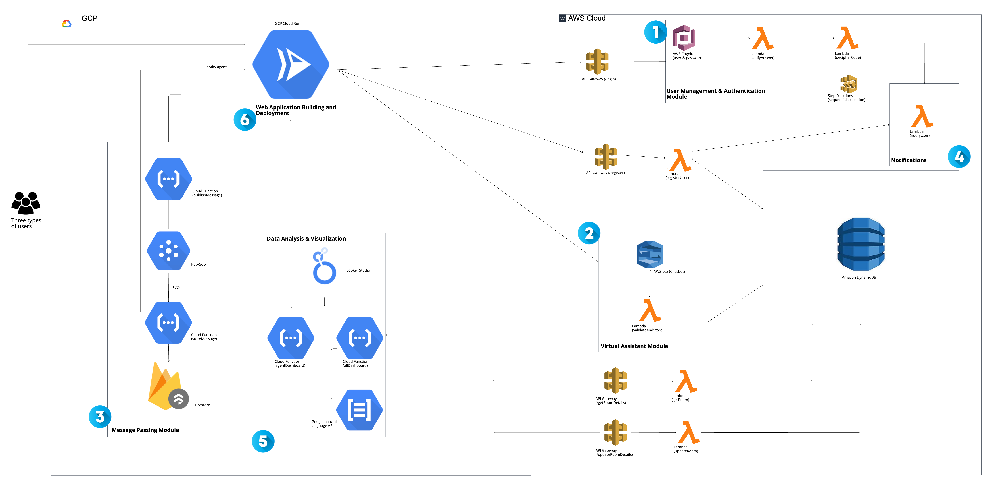

## Modules

### User Management & Authentication

- **Sign Up & Multi-Factor Authentication**
    - User registration through a lightweight front-end application
    - Store user details in DynamoDB
    - 1st factor: User ID/Password (AWS Cognito)
    - 2nd factor: Question/Answer (DynamoDB + AWS Lambda)
    - 3rd factor: Caesar cipher (AWS Lambda + DynamoDB)

**Login and Multi-Factor Authentication**

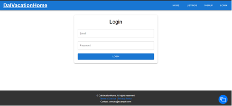
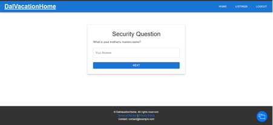

### Virtual Assistant

- **Online Virtual Assistance**
    - Respond to queries using AWS Lex, DynamoDB, and AWS Lambda
    - Support site navigation, room details retrieval, and customer-agent communication

**Virtual Assistant Interaction**

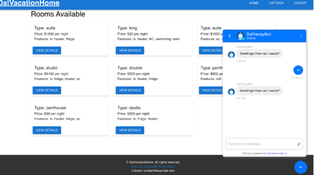
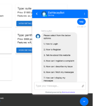
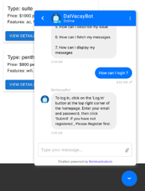
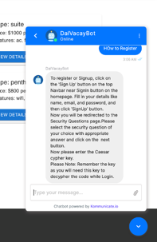
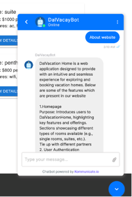
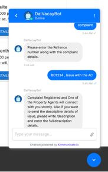

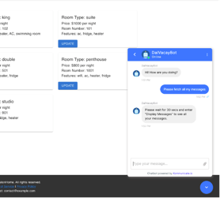
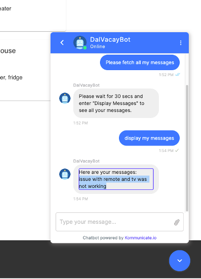

### Message Passing

- **Inter-Party Communication**
    - Use GCP Pub/Sub for message passing
    - Log communication in DynamoDB or Firestore

### Notifications

- **User Notifications**
    - Send notifications using AWS SNS and AWS SQS
    - Handle registration, login, booking confirmations, and failures

**Notification Module**

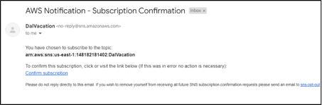
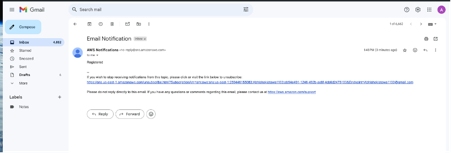
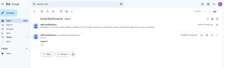

### Data Analysis & Visualization

- **Feedback Analysis**
    - Analyze customer feedback using Google Natural Language API
    - Display feedback and statistics in the frontend via LookerStudio

### Web Application Building and Deployment

- **Frontend Application**
    - Built with React
    - Hosted on GCP CloudRun
    - Automated deployment using CloudFormation or GCP Cloud Deployment Manager

**Dashboard Module**

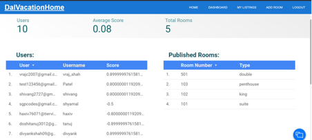
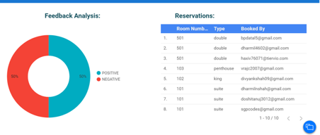

## Testing

- **Validation Tests**
    - Registered users' authentication, guest users' failed login
    - Data accuracy in upload-retrieval process
    - Chatbot response for valid/invalid utterances
    - API reliability and functionality
    - Lambda/Cloud Function testing

## Deployed Link
 [Link](https://dal-vacation-service-ugufm5l7ma-uc.a.run.app/)